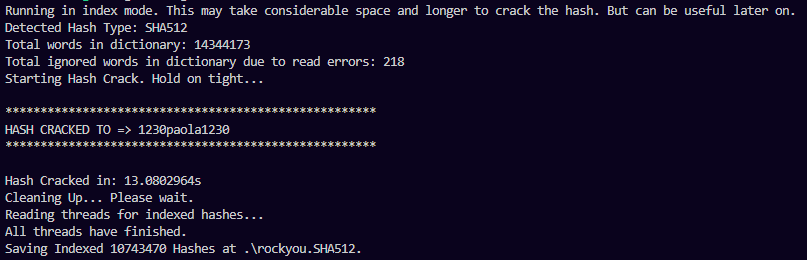

# Rust Hash Cracker
This Rust program is designed to crack hashed passwords using a dictionary attack. It supports various hash algorithms, including MD5, SHA-1, SHA-256, and SHA-512. Additionally, it can optionally maintain an index of checked hashes, making it useful for future reference.

# Usage
You can run the program with the following command:


``cargo run -- [OPTIONS]``

Replace [OPTIONS] with the required arguments and options:

```
-c or --hash: The hash to crack (required).
-d or --dict: The dictionary file to use (required).
-i or --index: Maintain an index of checked hashes (optional).
-t or --threads: Number of threads to use (default is 1).
```

# Example


``cargo run -- -c <HASH_TO_CRACK> -d <DICTIONARY_FILE> -i -t 4``


#### Above image shows cracking a SHA512 using rockyou.txt file containing over 14 million passowrds.

# Supported Hash Types
The program detects the hash type based on the length of the provided hash. Supported hash types include:

- MD5 (32 characters)
- SHA-1 (40 characters)
- SHA-256 (64 characters)
- SHA-512 (128 characters)

# Index Mode
When running in index mode (-i or --index), the program maintains an index of checked hashes. This may increase the time and storage requirements but can be useful for later reference.

# Note
The program checks the maximum number of threads, with a limit of 10 threads.
It reads the dictionary file specified and attempts to crack the provided hash using a parallelized approach.

If successful, it prints the cracked password.

If no match is found, it notifies the user.

# Building the Program
To build the program, you can use the cargo tool:


``cargo build --release``


# Author
Author: Noman Nasir Minhas
Version: 1.0.0